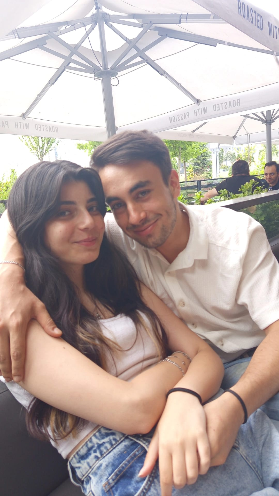
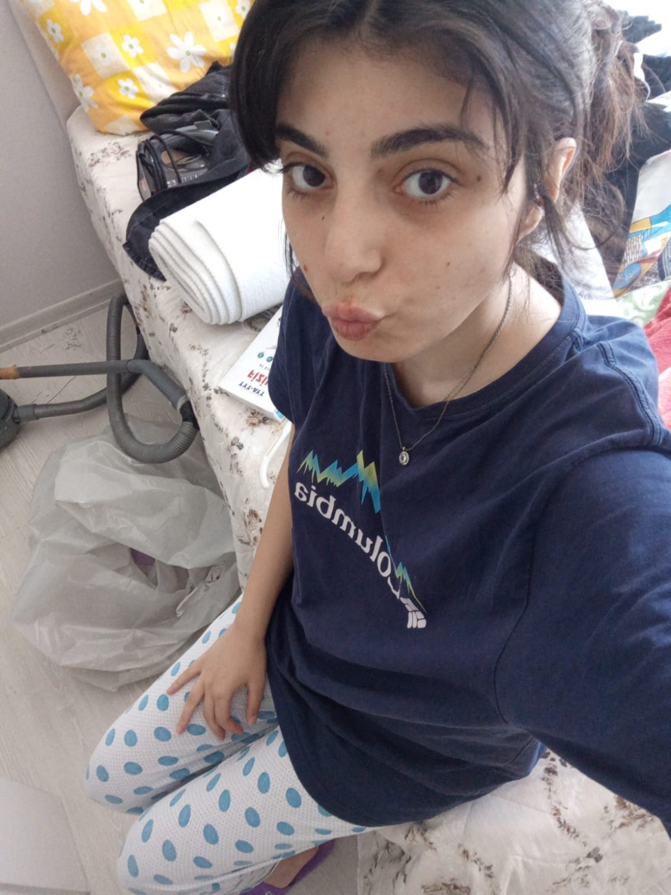

<!DOCTYPE html>
<html lang="tr">
<head>
  <meta charset="UTF-8">
  <title>Aleyna & Yasin – 6. Ayımız 💖</title>
  <meta name="viewport" content="width=device-width, initial-scale=1">
  
</head>
<body>
  

    <h1>💖 6. Ayımız Kutlu Olsun Aleynam 💖</h1>
    

      Bu küçük sayfa; hem bir özür, hem bir teşekkür, hem de bir kutlama... Seni çok seviyorum. 💞
    

    

Gözlerine bakamıyorum çünkü o an sadece şımarıyoruz.

    

Güneş seninle yarışıyordu. Ama senin gözlerin daha çok parlıyordu...

    

Bir gün bu karelere çocuklarımızla bakacağız.

    

Küçük şeylerle mutlu olduğumuz günler... En büyük mutluluklarımız.

    

Pijamalarla bile dünyanın en güzeli sensin.

    

Dil çıkarmışsın, çocuk gibisin… Ama ben o çocuk yanına da, kadın yanına da aşığım.

    

Hayalim: Uyanınca seni görmek, uyurken seni izlemek. Her sabah ve her gece...

    <footer>
      Aleyna & Yasin 🌙 30.12.2024   Kalbim hep seninle...
    </footer>
  

  <!-- Kalpler -->
  

  <!-- Papatyalar -->
  
</body>
</html>
